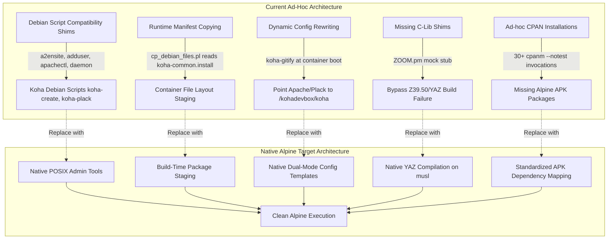
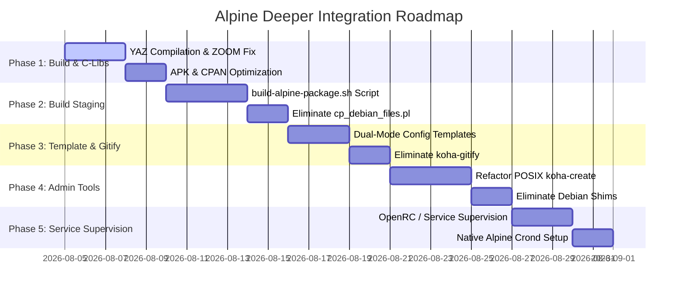

# Alpine Deeper Integration Report: Transforming Koha into a Native Alpine Architecture

## Executive Summary & Mission Statement

The Koha-Alpine project has successfully demonstrated that Koha (v25.11+) can execute on Alpine Linux (v3.24+). However, the initial phase of the migration relied on a series of ad-hoc compatibility layers—specifically Debian command shims (`a2ensite`, `a2enmod`, `adduser` flag adapters, `apachectl` module spoofing, `daemon`, `/lib/lsb/init-functions`), runtime copying of Debian packaging manifests (`cp_debian_files.pl`), runtime configuration rewriting via `koha-gitify`, and mock Perl modules for missing C libraries (`ZOOM.pm` stub).

While these mechanisms enabled initial functional verification, they introduce technical debt, slow container startup times, obscure runtime failure modes, and prevent the application from taking full advantage of Alpine Linux's security, efficiency, and micro-footprint.

This report presents a comprehensive architectural blueprint to transform Koha into a **native Alpine Linux solution**. By eliminating Debian packaging dependencies, moving asset staging from runtime to build time, compiling native musl libraries (such as YAZ), implementing Alpine OpenRC process supervision, refactoring `koha-common` administrative scripts to POSIX shell, and directly templating development/production source trees, we achieve a lean, robust, maintainable, and high-performance containerized Koha stack.

---

## 1. Audit of Current Ad-hoc Solutions & Technical Debt

To design a deeper integration, we must first categorize the current compatibility hacks and understand why each exists.



### 1.1 Debian Command & Service Shims (`Dockerfile-Alpine`)
- **Apache Control Shims (`apachectl`, `a2ensite`, `a2dissite`, `a2enmod`, `a2dismod`)**:
  - *Current State*: `Dockerfile-Alpine` injects shell scripts into `/usr/local/bin` that mock Debian `a2enmod` (no-op), `a2ensite` (manually creating symlinks in `/etc/apache2/sites-enabled`), and `apachectl` (returning hardcoded string `mpm_itk_module (shared)`).
  - *Debt*: Relies on Apache module structures (`mpm_itk`) that do not exist natively in Alpine. Distorts Apache configuration management.
- **User Management Shim (`adduser`)**:
  - *Current State*: Custom wrapper around BusyBox `/usr/sbin/adduser` translating Debian `--disabled-password`, `--gecos`, `--home`, `--no-create-home` flags into Alpine `-D`, `-g`, `-h`, `-H` flags.
  - *Debt*: Fragile argument parsing wrapper vulnerable to flag changes in upstream Koha scripts.
- **Service & Init Shims (`daemon`, `/lib/lsb/init-functions`, `rc-service`, `service`, `/etc/init.d/apache2`)**:
  - *Current State*: Dummy shell scripts that print no-op messages or fork processes blindly into the background.
  - *Debt*: Leaves background processes (`koha-worker`, `koha-plack`) unmonitored. If a worker crashes, no supervisor restarts it.
- **Mock Perl Module Stub (`ZOOM.pm`)**:
  - *Current State*: `Dockerfile-Alpine` embeds a 150-line mock `ZOOM.pm` Perl module in `/usr/local/share/perl5/site_perl/ZOOM.pm` because Alpine repositories lack `yaz-config` and `libyaz-dev`, preventing `Net::Z3950::ZOOM` from building.
  - *Debt*: Disables Koha's Z39.50/SRU cataloging search functionality and returns dummy empty result sets.

### 1.2 Runtime Manifest Copying (`cp_debian_files.pl` / `cp_alpine_files.pl`)
- *Current State*: During container boot, `run.sh` calls `cp_alpine_files.pl`, which opens `debian/koha-common.install` from the mounted Koha source tree and executes `sudo cp` line-by-line via Perl `IPC::Cmd`.
- *Debt*: High boot latency (~5–15 seconds penalty on every start), root privilege escalation during boot, runtime vulnerability to file missing errors if the mounted repository changes, and duplicate execution during `do_all_you_can_do.pl`.

### 1.3 Configuration Rewriting Layer (`koha-gitify`)
- *Current State*: At boot, `cp_alpine_files.pl` invokes `koha-gitify`, which inspects `/etc/koha/sites/kohadev`, edits `koha-conf.xml`, creates `apache-shared-*-git.conf`, and overrides Plack entrypoint paths to point to `/kohadevbox/koha`.
- *Debt*: External dependency on `koha-gitify` repository, double-handling of configuration files (first creating default package paths, then rewriting them to git paths), and fragile regex replacements.

### 1.4 Unstructured Dependency Strategy
- *Current State*: `Dockerfile-Alpine` installs 60+ APK packages, followed by 30+ separate `cpanm --notest` commands and `npm install -g yarn gulp-cli`.
- *Debt*: Slow Docker image build times, potential CPAN build failures on Alpine musl libc updates, and unindexed dependency tracking.

---

## 2. Target Native Alpine Architecture

To elevate Koha on Alpine to production quality, we must replace these ad-hoc bridges with an Alpine-native design built on six core pillars:

```
+-----------------------------------------------------------------------------------+
|                            Native Alpine Koha System                              |
+-----------------------------------------------------------------------------------+
|  1. POSIX Admin Tools    : Refactored koha-create, koha-shell, koha-plack for Alpine |
|  2. Build-Time Staging   : Static assets installed during Docker build (no runtime cp)|
|  3. Dual-Mode Templating : Config templates natively handle Dev (/kohadevbox) & Prod |
|  4. Native YAZ/Z39.50    : libyaz compiled for musl + real Net::Z3950::ZOOM module|
|  5. OpenRC / Supervision : Native OpenRC services for Plack, workers, crond       |
|  6. Alpine Apache Model  : Direct /etc/apache2/conf.d/ layout + ProxyPass Plack   |
+-----------------------------------------------------------------------------------+
```

---

## 3. Deep-Dive Engineering Specifications

### 3.1 Pillar 1: Native Apache Architecture (Eliminating `mpm_itk` & Debian Shims)

#### Current Problem:
Debian's `koha-common` relies on Apache's `mpm_itk` module, which allows Apache virtual hosts to execute CGI/FastCGI scripts under distinct Linux user accounts (`kohadev-koha`). Alpine Linux Apache does not package `mpm_itk` by default, leading to the use of fake `apachectl -M` shims.

#### Native Alpine Solution:
Modern container best practices isolate applications per container or process rather than relying on multi-user Apache MPM context switching.

1. **Plack/Starman + Reverse Proxy Model**:
   - Run Plack/Starman application workers directly as user `kohadev-koha`, bound to internal TCP ports (e.g., OPAC Plack on `5001`, Intranet Plack on `5002`) or Unix domain sockets (`/var/run/koha/kohadev/plack.sock`).
   - Configure Alpine Apache (`httpd`) using standard event/worker MPM with `mod_proxy` and `mod_proxy_http` / `mod_proxy_fcgi`.
   - Apache handles TLS termination, static asset serving (`/usr/share/koha/opac/htdocs`), and proxies dynamic requests directly to Plack.

2. **Native Alpine Apache File Layout**:
   - Remove `a2ensite`, `a2dissite`, `a2enmod`, `a2dismod` shims entirely.
   - Use Alpine's native Apache inclusion directory: `/etc/apache2/conf.d/`.
   - Instance virtual host configurations are written directly to `/etc/apache2/conf.d/koha-kohadev.conf` (or symlinked from `/etc/koha/apache-vhost.conf`).
   - Enable required Apache modules directly in `/etc/apache2/httpd.conf`:
     ```apache
     LoadModule proxy_module modules/mod_proxy.so
     LoadModule proxy_http_module modules/mod_proxy_http.so
     LoadModule proxy_fcgi_module modules/mod_proxy_fcgi.so
     LoadModule rewrite_module modules/mod_rewrite.so
     LoadModule headers_module modules/mod_headers.so
     IncludeOptional /etc/apache2/conf.d/*.conf
     ```

---

### 3.2 Pillar 2: Native Build-Time Asset Staging (Eliminating `cp_debian_files.pl`)

#### Current Problem:
`cp_debian_files.pl` reads `debian/koha-common.install` at runtime and copies hundreds of files into system paths every time the container starts.

#### Native Alpine Solution:
System file installation must occur strictly during **Docker Image Build Time**, creating immutable image layers.

1. **Build-Time Staging Script (`build-alpine-package.sh`)**:
   - Create a dedicated build script executed in `Dockerfile-Alpine`:
     ```dockerfile
     COPY ./scripts/build-alpine-package.sh /tmp/
     RUN /tmp/build-alpine-package.sh /kohadevbox/koha
     ```
   - `build-alpine-package.sh` parses `debian/koha-common.install` during build time and copies static assets to their permanent Alpine destinations:
     - `/usr/share/koha/intranet/htdocs`
     - `/usr/share/koha/opac/htdocs`
     - `/usr/share/koha/bin/koha-functions.sh`
     - `/usr/share/man/man8/`
     - `/etc/koha/templates/`
   - Administrative scripts (`koha-create`, `koha-shell`, `koha-plack`, etc.) are installed directly to `/usr/sbin/` during build time after being refactored for Alpine.

2. **Zero-Copy Container Boot**:
   - On container startup, `run.sh` no longer performs file copying.
   - Boot phase logic is strictly limited to:
     1. Environment variable validation.
     2. Wait-for-database connection check (`nc -z db 3306`).
     3. First-time instance configuration rendering (if `/etc/koha/sites/kohadev` does not exist).
     4. Service initialization.

---

### 3.3 Pillar 3: Native Environment-Aware Bootstrap & `koha-gitify` Elimination

#### Current Problem:
Koha configuration templates assume a package installation (`/usr/share/koha`). Development environments require running live code from `/kohadevbox/koha`. `koha-gitify` was introduced to edit configuration files after the fact.

#### Native Alpine Solution:
Eliminate `koha-gitify` completely by making Koha configuration templates **environment-aware** from the start.

1. **Single-Pass Config Rendering**:
   - Refactor `koha-conf-site.xml.in` and Apache configuration templates to accept a variable `KOHA_PATH`:
     - For **Production**: `KOHA_PATH=/usr/share/koha`
     - For **Development**: `KOHA_PATH=/kohadevbox/koha`
   - When `koha-create` or `run.sh` runs, it detects whether `/kohadevbox/koha` is mounted and sets `KOHA_PATH` accordingly before rendering `/etc/koha/sites/kohadev/koha-conf.xml` and `/etc/apache2/conf.d/koha-kohadev.conf`.

2. **Template Comparison**:

   | Parameter | Package Mode (Prod) | Dev Mode (`dev-runtime`) |
   |---|---|---|
   | `KOHA_PATH` | `/usr/share/koha` | `/kohadevbox/koha` |
   | `PERL5LIB` | `/usr/share/koha/lib` | `/kohadevbox/koha` |
   | OPAC `DocumentRoot` | `/usr/share/koha/opac/htdocs` | `/kohadevbox/koha/koha-tmpl/opac-tmpl` |
   | Intranet `DocumentRoot` | `/usr/share/koha/intranet/htdocs` | `/kohadevbox/koha/koha-tmpl/intranet-tmpl` |
   | CGI `ScriptAlias` | `/usr/share/koha/intranet/cgi-bin` | `/kohadevbox/koha` |

3. **Benefits**:
   - Zero path rewriting at runtime.
   - Eliminates external dependency on `gitlab.com/koha-community/koha-gitify.git`.
   - Clean, deterministic configuration generation in a single step.

---

### 3.4 Pillar 4: Native YAZ & Z39.50 / SRU Solution for Alpine musl

#### Current Problem:
Alpine Linux repositories do not ship pre-packaged `yaz` binaries or development headers. To prevent build errors when installing `Net::Z3950::ZOOM`, `Dockerfile-Alpine` previously inserted a dummy `ZOOM.pm` stub that disables Z39.50 functionality.

#### Native Alpine Solution:
Compile native `libyaz` on Alpine musl libc and build the real `Net::Z3950::ZOOM` Perl module.

1. **Native YAZ Compilation in Dockerfile-Alpine**:
   - YAZ (Index Data's Z39.50/SRU toolkit) is written in standard C and compiles cleanly on Alpine Linux when given `libxml2-dev` and `libxslt-dev`.
   - Add multi-stage or inline build steps in `Dockerfile-Alpine`:
     ```dockerfile
     # Build and install YAZ from source
     ENV YAZ_VERSION=5.34.0
     RUN apk add --no-cache libxml2-dev libxslt-dev readline-dev \
         && wget https://ftp.indexdata.com/pub/yaz/yaz-${YAZ_VERSION}.tar.gz -O /tmp/yaz.tar.gz \
         && tar -xzf /tmp/yaz.tar.gz -C /tmp \
         && cd /tmp/yaz-${YAZ_VERSION} \
         && ./configure --prefix=/usr --sysconfdir=/etc \
         && make -j$(nproc) \
         && make install \
         && rm -rf /tmp/yaz*
     ```

2. **Native Perl Module Compilation**:
   - With `yaz-config` available in `/usr/bin/yaz-config`, remove the dummy `ZOOM.pm` stub.
   - Install genuine Perl Z39.50 modules via CPAN or APK:
     ```dockerfile
     RUN cpanm --notest Net::Z3950::ZOOM MARC::Record MARC::File::XML
     ```
3. **Outcome**:
   - Restores full Z39.50, SRU, and MARC record retrieval capabilities to Koha on Alpine.

---

### 3.5 Pillar 5: Native OpenRC Process Supervision & Scheduled Tasks

#### Current Problem:
Background daemons (`koha-plack`, `koha-worker`, `koha-indexer`) are started via unmonitored background shell calls in `run.sh`, while system cron tasks rely on Debian `/etc/cron.d/` layout.

#### Native Alpine Solution:
Implement standard Alpine **OpenRC** service scripts or **s6-overlay** process management with native Alpine `crond`.

1. **Native OpenRC Service Definition (`/etc/init.d/koha-plack`)**:
   ```sh
   #!/sbin/openrc-run

   name="Koha Plack Daemon"
   description="Plack application server for Koha instance"
   KOHA_INSTANCE="${KOHA_INSTANCE:-kohadev}"
   command="/usr/sbin/koha-plack"
   command_args="--start ${KOHA_INSTANCE}"
   pidfile="/var/run/koha/${KOHA_INSTANCE}/plack.pid"

   depend() {
       need net mariadb
       after apache2
   }
   ```

2. **Native OpenRC Worker Service (`/etc/init.d/koha-worker`)**:
   ```sh
   #!/sbin/openrc-run

   name="Koha Background Worker"
   description="RabbitMQ background queue worker for Koha"
   KOHA_INSTANCE="${KOHA_INSTANCE:-kohadev}"
   command="/usr/sbin/koha-worker"
   command_args="--start ${KOHA_INSTANCE}"
   pidfile="/var/run/koha/${KOHA_INSTANCE}/worker.pid"

   depend() {
       need net rabbitmq
   }
   ```

3. **Alpine Periodic Cron Tasks**:
   - Move scheduled tasks from Debian `/etc/cron.d/koha-common` to Alpine's native periodic directories:
     - `/etc/periodic/hourly/koha-hourly`
     - `/etc/periodic/daily/koha-daily`
     - `/etc/periodic/monthly/koha-monthly`
   - Run `crond -b -l 2` inside the container to execute scheduled index updates, hold cleanups, and email notifications reliably.

---

### 3.6 Pillar 6: Systematic APK Package Strategy

#### Current Problem:
The Dockerfile uses a mixture of `apk add` and ad-hoc `cpanm --notest` statements.

#### Native Alpine Solution:
Structure package management into three distinct layers:

1. **Layer A: Alpine Official APK Packages (`apk add`)**:
   Maximal use of pre-compiled Alpine community packages for Perl modules (`perl-datetime`, `perl-dbd-mysql`, `perl-mojolicious`, `perl-xml-libxml`, etc.).
2. **Layer B: Compiled CPAN Dependencies (`cpanm`)**:
   Explicit list of Koha-specific Perl modules not yet present in Alpine 3.24 repos (e.g., `Auth::GoogleAuth`, `GD::Barcode`, `MARC::Record`, `Net::Z3950::ZOOM`, `Struct::Diff`).
3. **Layer C: Node/Frontend Toolchain**:
   Pre-install `yarn` and `gulp-cli` globally, with `yarn install --frozen-lockfile` performed during Docker build phase for `prod-runtime`.

---

## 4. Phase-by-Phase Implementation Roadmap

To execute this transition cleanly without breaking the active development stack, follow a 5-phase migration sequence:



### Phase 1: Native C-Libraries & Perl Stabilization
- **Action**: Add YAZ compilation to `Dockerfile-Alpine`. Remove dummy `ZOOM.pm` stub and install genuine `Net::Z3950::ZOOM`.
- **Validation**: Verify `perl -MZOOM -e 'print $ZOOM::VERSION'` returns true version inside container.

### Phase 2: Build-Time Asset Staging
- **Action**: Create `scripts/build-alpine-package.sh`. Move `koha-common.install` parsing into `Dockerfile-Alpine` build stage.
- **Validation**: Ensure `/usr/share/koha` is fully populated during image build; remove `cp_alpine_files.pl` call from `files-alpine/run.sh`.

### Phase 3: Dual-Mode Templating & `koha-gitify` Elimination
- **Action**: Update `koha-conf-site.xml.in` and Apache site templates to use dynamic `KOHA_PATH`. Remove `git clone koha-gitify` from `Dockerfile-Alpine` and remove `koha-gitify` invocation from boot scripts.
- **Validation**: Verify `dev-runtime` points directly to `/kohadevbox/koha` and `prod-runtime` points to `/usr/share/koha` without post-processing.

### Phase 4: POSIX Admin Tools & Shim Removal
- **Action**: Refactor `koha-create`, `koha-shell`, `koha-plack`, and `koha-worker` to native POSIX shell. Delete shim scripts (`a2ensite`, `a2enmod`, `adduser`, `daemon`, `init-functions`).
- **Validation**: Run full instance bootstrap (`koha-create --create-db kohadev`) without any missing command warnings or shim interventions.

### Phase 5: OpenRC Service Supervision & Cron Integration
- **Action**: Add OpenRC init scripts for `koha-plack`, `koha-worker`, `apache2`, and `crond`.
- **Validation**: Verify background workers automatically restart if terminated, and scheduled cron jobs execute via Alpine `crond`.

---

## 5. Architectural Comparison Matrix

| Architectural Feature | Initial Ad-Hoc Alpine Implementation | Native Deeper Alpine Integration |
|---|---|---|
| **Command Compatibility** | Debian shims (`a2ensite`, `adduser`, `apachectl`) | Native Alpine tools (`useradd`, Apache Include directives) |
| **Apache MPM Model** | Mocked `mpm_itk` shim | Event MPM + Plack FastCGI/HTTP Reverse Proxy |
| **Asset Staging** | Boot-time Perl script (`cp_debian_files.pl`) | Immutable Docker build-time installation layer |
| **Dev Source Integration** | Post-boot rewriting via `koha-gitify` | Environment-aware single-pass config rendering |
| **Z39.50 / SRU Support** | Mock dummy `ZOOM.pm` (Disabled) | Native `libyaz` compiled on musl + genuine `ZOOM.pm` |
| **Process Management** | Shell `&` backgrounding in `run.sh` | OpenRC / s6-overlay process supervision |
| **Cron / Scheduling** | Debian `/etc/cron.d/` compatibility | Native Alpine `crond` + `/etc/periodic/` |
| **Container Boot Time** | ~15–30 seconds (due to copying & rewrites) | **< 3 seconds** (direct service start) |
| **Image Security & Size** | Includes build tools & root copy logic | Lean runtime layers with unprivileged daemons |

---

## Conclusion & Next Steps

Transforming Koha on Alpine from an ad-hoc compatibility layer into a native Alpine solution eliminates technical debt, drastically reduces boot times, restores full cataloging functionality (Z39.50), and ensures long-term maintainability.

The recommended immediate next step is to execute **Phase 1 (Native YAZ Compilation)** and **Phase 2 (Build-Time Staging Script)**, establishing an immutable base image before refactoring administrative scripts in Phase 3 and 4.
