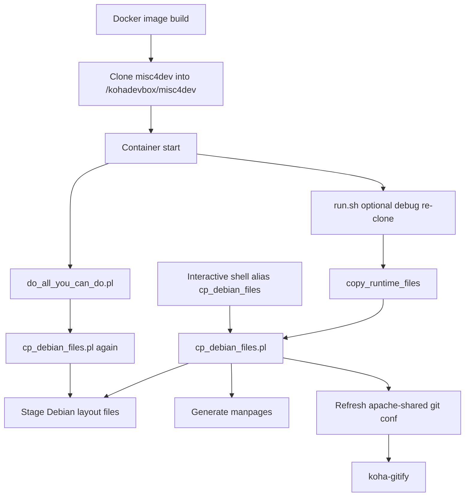
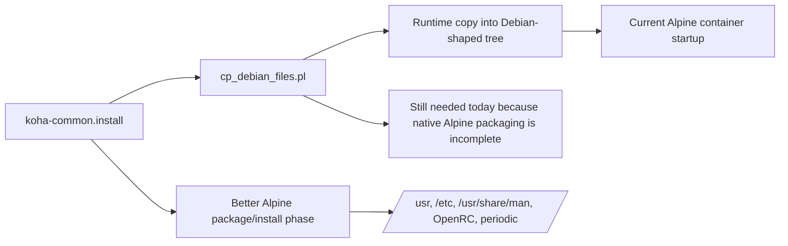
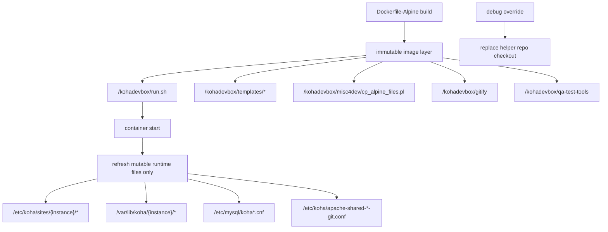

<!-- markdownlint-disable MD013 MD032 -->

# cp_debian_files.pl Alpine Migration Report

## 1) What this report covers

This report investigates everything `cp_debian_files.pl` does when it runs in the Alpine container stack, who calls it, when it is called, and how each file listed in `koha/debian/koha-common.install` should be treated from an Alpine Linux perspective.

The goal is to understand which resources can stay as application-owned runtime assets, which ones should be moved to Alpine-native locations, and which ones should be absorbed into image build or APK packaging rather than copied at startup.

## 2) Who calls `cp_debian_files.pl`, when, and in what context

### 2.1 Direct runtime call from `run.sh`

`files-alpine/run.sh` calls the helper during container startup, after the optional debug re-clone step and before database probing and bootstrap work. The runtime flow is:

1. Optional `DEBUG_GIT_REPO_MISC4DEV=yes` re-clone.
2. `copy_runtime_files`.
3. `copy_runtime_files` falls back to `/kohadevbox/misc4dev/cp_debian_files.pl` when `/kohadevbox/misc4dev/cp_alpine_files.pl` is not available at runtime inside the container.

Relevant context in the active Alpine entrypoint:

- `files-alpine/run.sh` explicitly says “Clone before calling cp_debian_files.pl”.
- The currently baked image and the optional runtime debug clone are both checked at the container path `/kohadevbox/misc4dev/cp_alpine_files.pl`. If that executable file is absent there, `copy_runtime_files` uses `/kohadevbox/misc4dev/cp_debian_files.pl` instead. That check is about the future container filesystem, not the host workspace path.

In run.sh:120 the early copy_runtime_files happens before database probing, before koha-create/instance bootstrap, and before the later do_all_you_can_do.pl phase. That means it is there to make the instance filesystem and Apache/Koha layout exist early enough for bootstrap to run at all. The helper it calls is the one that stages the runtime files, and its Alpine path is checked in run-sh-alpine.sh:107. So this first call is a prerequisite for startup, not a dry-run.

The second call inside do_all_you_can_do.pl:128 is genuinely overlapping. It repeats the Debian-file staging after the database branch, because that script is written as a self-contained “do everything” bootstrap and assumes it may need to refresh the instance layout again after DB creation, SIP setup, plack regeneration, and related steps.

So the duplication is real, but the two calls are not identical in purpose:

the early call is needed to prepare the container before bootstrap,
the later call is part of the full bootstrap script contract and re-applies the layout after DB setup.
If your goal is to remove duplication later, the safest split is:

- keep the early call for minimum pre-bootstrap staging,
- make the later cp_debian_files.pl path inside do_all_you_can_do.pl conditional or replace it with an Alpine-specific narrower refresh step.
- That would reduce repeated work without breaking existing startup behavior.

The refresh step exists because the container does not start with a usable Koha runtime layout. The first call to `copy_runtime_files` in `run.sh` materializes the instance filesystem before database probing and before bootstrap. In practice, that means it creates or refreshes the files that later steps need to exist already: Koha site config under /etc/koha, helper commands under `/usr/sbin` and `/usr/share/koha/bin`, manpages, Apache git-mode config, and the instance-specific rewrites performed by koha-gitify.

So it is not just a “checkup.” It is a prerequisite staging step. The logic in run-sh-alpine.sh:107 is: if an Alpine-specific helper exists at runtime inside the container, use it; otherwise fall back to the Debian-oriented helper. That early refresh makes the startup path work before koha-create, Apache, and the later do_all_you_can_do.pl:128 pass run.

The duplication is real, but the first call is there to get the container bootstrapped at all. The second call is the broader “do everything” pass that repeats the layout refresh after DB setup.

The file `cp_debian_files.pl` is being used as a convergence step, not as a presence check.

The second call in `do_all_you_can_do.pl`:128 does not ask “does this file exist?” It asks “make the runtime tree match what the Koha source tree and Debian manifest expect right now.” That is why it uses plain `cp` for every manifest entry. Existence alone would be too weak, because a file can exist and still be wrong:

- stale from an older image layer or previous container start
- modified by an earlier bootstrap step
- carrying the wrong permissions or ownership
- coming from a previous Koha revision, not the current checkout

The first staging in `run.sh`:120 is needed to get the container into a usable state before DB probing and bootstrap. The second staging is there because `do_all_you_can_do.pl` is designed as a self-contained “do everything” script and re-applies the package-style layout as part of that contract. In other words, the duplication is intentional defensive behavior, not a simple existence check.

If you want to remove redundancy later, the right fix is not “check if files exist,” but “separate immutable build-time files from mutable runtime-generated files and only refresh the mutable set.” That gives you a narrower Alpine-native refresh path without risking stale configuration.

### 2.2 Transitive call from `do_all_you_can_do.pl`

`do_all_you_can_do.pl` calls `cp_debian_files.pl` again after the database phase. That second invocation happens in the middle of the larger bootstrap sequence, after any fresh DB initialization and before Zebra, SIP, Plack, Elasticsearch, and package-runtime cleanup work.

This makes `cp_debian_files.pl` both a startup staging tool and a post-DB refresh tool.

### 2.3 Manual shell invocation

`files-alpine/templates/bash_aliases` exposes a `cp_debian_files` alias for interactive use. That is the operator path for restaging after source edits or after a manual repair.

### 2.4 Call-chain diagram

## 3) What `cp_debian_files.pl` actually does

The script is a raw filesystem staging tool with a small amount of post-processing.

### 3.1 Manifest-driven copy loop

It opens `koha/debian/koha-common.install` from the mounted Koha source tree and reads it line by line.

For each entry it:

- normalizes whitespace
- splits the line into `from` and `to`
- skips lines without a destination
- skips anything under `/tmp/`
- skips anything under `/tmp_docbook/` because that output is handled later
- copies the source file into the target path with `sudo cp`

### 3.2 Additional Debian compatibility files

After the manifest copy loop, it copies a fixed set of Debian support files:

- `koha-common.bash-completion`
- `koha-common.cron.d`
- `koha-common.cron.daily`
- `koha-common.cron.hourly`
- `koha-common.cron.monthly`
- `koha-common.default`
- `koha-common.init`
- `koha-common.logrotate`

### 3.3 Manpage generation

It generates manpages from the Koha Debian docs using `xsltproc`, then removes stale `koha-*.8.gz` files and gzips the generated pages.

### 3.4 Apache and gitified instance refresh

It then:

- copies `debian/templates/apache-shared*.conf` into `/etc/koha/`
- deletes the `*-git.conf` files so they can be regenerated
- runs `koha-gitify` from the cloned `gitify` repository
- chowns `/etc/koha/sites/$instance` to the instance user

So the script is not just copying files; it is also rebuilding the instance-facing Apache/Koha layout.

## 4) File-by-file mapping from `koha-common.install` to Alpine-native reasoning

The table below maps each install-manifest entry to the current target and the Alpine-native interpretation.

| `koha-common.install` entry | Current target | Alpine-native reasoning |
|---|---|---|
| `debian/tmp/usr/*` | `/usr` | Keep under `/usr`. This is generic package payload and already aligns with Alpine filesystem layout. The real migration work is not the path, but eliminating Debian packaging assumptions before install time. |
| `debian/tmp/etc/koha/zebradb/[!z]*` | `/etc/koha/zebradb/...` | Keep under `/etc/koha`. Zebra definitions are runtime configuration owned by Koha, not system-wide Alpine config. They should remain app-managed config data, even if later generated by Alpine packaging. |
| `debian/tmp/etc/koha/z3950` | `/etc/koha/z3950` | Keep under `/etc/koha`. This is service/runtime configuration for Koha's Z39.50-related setup, so it belongs with the application config rather than a distro-global Alpine path. |
| `debian/templates/*` | `/etc/koha` | Keep the rendered output in `/etc/koha`, but consider splitting the source templates into Alpine package assets or `/usr/share/koha/templates` if you want a cleaner native packaging model. The duplicate manifest line means the same family is staged twice. |
| `debian/koha-post-install-setup` | `/usr/sbin` | This is packaging/setup logic, not user-facing runtime functionality. On Alpine it should ideally be absorbed into the APK post-install script or an installer hook; if kept as a callable helper, `/usr/libexec/koha` or `/usr/sbin` are the realistic homes. |
| `debian/unavailable.html` | `/usr/share/koha/intranet/htdocs` | Keep as a static application asset. Alpine does not require a new path here; this is web content, so it belongs under Koha's static document tree. |
| `debian/unavailable.html` | `/usr/share/koha/opac/htdocs` | Same as above: static web asset, app-owned, fine under `/usr/share/koha/...`. |
| `debian/templates/*` | `/etc/koha` | Same manifest family as above. In Alpine terms, the output should still be configuration in `/etc`, while the source of truth can move into image build assets rather than runtime copying. |
| `debian/scripts/koha-functions.sh` | `/usr/share/koha/bin` | Keep as an application helper library. It is sourced by other scripts, not executed as a system command, so `/usr/share/koha/bin` or `/usr/libexec/koha` are the appropriate app-owned locations. |
| `debian/scripts/koha-create` | `/usr/sbin` | Administrative command. It can stay as a privileged admin entrypoint, but the implementation should become Alpine-aware instead of Debian-maintainer-script aware. |
| `debian/scripts/koha-create-dirs` | `/usr/sbin` | Administrative setup helper. Keep as a privileged helper or fold it into Alpine package/install logic if the directory creation becomes native to the image build. |
| `debian/scripts/koha-disable` | `/usr/sbin` | Admin lifecycle command; the path is acceptable, but the script content must stop assuming Debian service tooling. |
| `debian/scripts/koha-dump` | `/usr/sbin` | Administrative backup/export helper. This can stay under `/usr/sbin` because it is operational, not user content. |
| `debian/scripts/koha-dump-defaults` | `/usr/sbin` | Same rationale as `koha-dump`: admin helper, not static data. |
| `debian/scripts/koha-elasticsearch` | `/usr/sbin` | Search backend helper. On Alpine it should still be a privileged admin command, but it needs Alpine-compatible service and package assumptions. |
| `debian/scripts/koha-email-disable` | `/usr/sbin` | Admin lifecycle helper. Path can remain, implementation must be Alpine-safe. |
| `debian/scripts/koha-email-enable` | `/usr/sbin` | Same as above. |
| `debian/scripts/koha-enable` | `/usr/sbin` | Admin lifecycle helper. Keep as a command, but replace Debian-specific service coupling with Alpine/OpenRC behavior. |
| `debian/scripts/koha-es-indexer` | `/usr/sbin` | Runtime admin tool for index maintenance. Keep as operational command, but package it natively rather than staging it via Debian manifest. |
| `debian/scripts/koha-foreach` | `/usr/sbin` | Privileged operational helper. No path change needed; Alpine adaptation is in dependencies and service integration. |
| `debian/scripts/koha-indexer` | `/usr/sbin` | Search/index helper. Same treatment as other admin scripts. |
| `debian/scripts/koha-list` | `/usr/sbin` | Admin inventory helper. Same treatment. |
| `debian/scripts/koha-mysql` | `/usr/sbin` | Database wrapper helper. Keep as a privileged command, but its MySQL client assumptions should be verified against Alpine's MariaDB client tooling. |
| `debian/scripts/koha-passwd` | `/usr/sbin` | Privileged account-management helper. Path can stay, but the implementation should be Alpine-compatible. |
| `debian/scripts/koha-plack` | `/usr/sbin` | Service-control helper. This needs Alpine/OpenRC-aware behavior even if the command name stays the same. |
| `debian/scripts/koha-rebuild-zebra` | `/usr/sbin` | Service/index helper. Keep as an admin command, but adapt the runtime assumptions to Alpine and the current search backend model. |
| `debian/scripts/koha-remove` | `/usr/sbin` | Administrative uninstall helper. It is package-like logic and should be either packaged or folded into build-time tooling. |
| `debian/scripts/koha-reset-passwd` | `/usr/sbin` | Admin helper, acceptable in `/usr/sbin`. |
| `debian/scripts/koha-restore` | `/usr/sbin` | Backup/restore helper. Keep as an admin command. |
| `debian/scripts/koha-run-backups` | `/usr/sbin` | Scheduled maintenance helper. In Alpine, the command can stay, but the scheduling should be OpenRC/periodic-aware. |
| `debian/scripts/koha-shell` | `/usr/sbin` | Privileged shell wrapper. Keep as an admin command, but it must integrate with Alpine users and service conventions. |
| `debian/scripts/koha-sip` | `/usr/sbin` | SIP service helper. Keep as an admin command; adapt service startup and config handling to Alpine. |
| `debian/scripts/koha-sitemap` | `/usr/sbin` | Site maintenance helper. Same admin-command treatment. |
| `debian/scripts/koha-translate` | `/usr/sbin` | Translation helper. This is still an admin tool, but Alpine packaging should move the resource staging away from runtime copying. |
| `debian/scripts/koha-upgrade-schema` | `/usr/sbin` | Upgrade helper. Keep as an admin command, but it should be packaged with Alpine-compatible dependency paths. |
| `debian/scripts/koha-upgrade-to-3.4` | `/usr/sbin` | Legacy upgrade helper. In a native Alpine packaging design this should likely remain as compatibility-only tooling, not part of the normal runtime path. |
| `debian/scripts/koha-worker` | `/usr/sbin` | Background worker control helper. Keep as a command, but its service integration must be rewritten for Alpine. |
| `debian/scripts/koha-z3950-responder` | `/usr/sbin` | Service helper for Z39.50 responder. Keep as an admin command, but migrate service behavior to Alpine conventions. |
| `debian/scripts/koha-zebra` | `/usr/sbin` | Legacy Zebra helper. Keep only if the feature remains relevant; Alpine packaging should not depend on Debian service semantics. |
| `debian/tmp_docbook/*.8` | `/usr/share/man/man8` | Keep in `/usr/share/man/man8`. Manpages are distribution-neutral and already live in the correct Alpine-friendly location. |

## 5) What the table means for Alpine migration

The manifest shows three broad classes of resources:

### 5.1 Resources that already fit Alpine well

- `/usr` payload
- static web assets under `/usr/share/koha/...`
- manpages under `/usr/share/man/man8`
- config under `/etc/koha`

These do not need a path redesign; they need the packaging flow to stop depending on Debian package scripts at runtime.

### 5.2 Resources that should become Alpine-native service/config assets

- `koha-common.default` should become OpenRC config, typically `/etc/conf.d/koha-common`
- `koha-common.init` should become an OpenRC service script in `/etc/init.d/koha-common`
- `koha-common.cron.*` should become Alpine periodic jobs under `/etc/periodic/{daily,hourly,monthly}`

These are the clearest “native Alpine” conversion points.

### 5.3 Resources that should probably move into APK install-time logic

- `koha-post-install-setup`
- the `koha-common.install`-driven file copy loop itself

These are packaging actions masquerading as runtime actions. In a native Alpine design, they belong in the package build/install phase, not in container entrypoint logic.

## 6) Mermaid view of the migration boundary

## 7) Practical conclusions

`cp_debian_files.pl` is the bridge between a Debian-shaped Koha world and the Alpine container runtime. It does four things at once:

1. copies manifest-listed files into target locations
2. installs Debian helper files
3. generates documentation
4. re-gitifies the instance config

For Alpine migration, the important observation is that not all of those actions are equally “runtime-worthy.”

The highest-value Alpine-native changes are:

- replace Debian cron/default/init layout with Alpine OpenRC and periodic equivalents
- absorb packaging-only file staging into image build or package install time
- keep application config and static assets under Koha-owned `/etc/koha` and `/usr/share/koha` locations
- preserve admin commands under `/usr/sbin` only as transitional compatibility layers until they can be packaged natively

In short: the current script is still doing Debian packaging work inside the container. The Alpine target should be to push that work left into build/install time and leave runtime with only genuine instance-specific setup.

## 8) Build workflow vs bootstrap workflow: immutable and mutable files

The cleanest way to reason about this container is to split the filesystem into two groups:

1. immutable by image build: files copied into the image layer and not meant to be rewritten during a normal container start
2. mutable at runtime: files intentionally generated or refreshed every bootstrap because they depend on the selected Koha instance, current DB state, or current checkout state

### 8.1 Immutable build-time files

These are created while building `Dockerfile-Alpine` and should be treated as fixed inputs for a normal container start:

- `/kohadevbox/run.sh`
- `/kohadevbox/apply-patches.sh`
- `/kohadevbox/lib/*`
- `/kohadevbox/templates/*`
- `/kohadevbox/git_hooks/*`
- `/etc/mysql/ssl/*`
- `/kohadevbox/templates/defaults.env`
- `/kohadevbox/misc4dev/cp_alpine_files.pl`
- the image-baked helper repos at `/kohadevbox/misc4dev`, `/kohadevbox/gitify`, and `/kohadevbox/qa-test-tools`

These are immutable in the normal boot path because they come from the image layer, not from runtime logic. The only exception is the explicit debug override path, which can replace some of them at container startup for development.

### 8.2 Mutable runtime-generated files

These are created or refreshed by `run.sh`, `cp_debian_files.pl`, `koha-gitify`, `koha-create`, or `do_all_you_can_do.pl`:

- `/etc/koha/koha-conf-site.xml.in`
- `/etc/koha/koha-sites.conf`
- `/etc/sudoers.d/${KOHA_INSTANCE}`
- `/etc/koha/sites/${KOHA_INSTANCE}/koha-conf.xml`
- `/etc/koha/sites/${KOHA_INSTANCE}/plack.psgi`
- `/etc/koha/sites/${KOHA_INSTANCE}/SIPconfig.xml`
- `/etc/koha/apache-shared-opac-git.conf`
- `/etc/koha/apache-shared-intranet-git.conf`
- `/etc/apache2/envvars`
- `/var/lib/koha/${KOHA_INSTANCE}/.bashrc`
- `/var/lib/koha/${KOHA_INSTANCE}/.bash_aliases`
- `/var/lib/koha/${KOHA_INSTANCE}/.vimrc`
- `/var/lib/koha/${KOHA_INSTANCE}/.cache/`
- `/var/log/koha/${KOHA_INSTANCE}/*`
- `/etc/mysql/koha-common.cnf`
- `/etc/mysql/koha_${KOHA_INSTANCE}.cnf`
- `/etc/hosts` entries for the Koha FQDNs
- `/usr/share/man/man8/koha-*.8.gz`
- `/etc/koha/zebradb/*`
- `/usr/sbin/*` files copied from the Koha Debian manifest

These must stay mutable for now because they depend on:

- the active instance name
- the selected DB/TLS mode
- the mounted Koha checkout
- the current bootstrap profile
- whether the database is fresh or already populated

### 8.3 Why only the mutable set should be refreshed

The refresh step is needed for mutable files because a restart must converge the container to the current source tree and current instance settings. The immutable build-time layer should not be recopied every start, because that creates unnecessary churn and hides what is truly instance-specific.

In practical terms:

- build once: bake the static helper files and supporting assets into the image
- start many times: refresh only the files that are supposed to reflect current runtime state

### 8.4 Workflow diagram

## 9) Operational conclusion

For the Alpine migration, the target state is not “never copy anything again.” The target is:

- keep the build-baked layer stable and reproducible
- let the container bootstrap rewrite only the mutable instance-state files
- eliminate Debian-shaped refreshes only after the Alpine-native equivalents exist

That gives you a much clearer boundary for later refactoring: anything in the immutable build-time list should move toward the Dockerfile or APK packaging, while anything in the mutable list should remain under runtime control until its Alpine-native replacement is complete.
