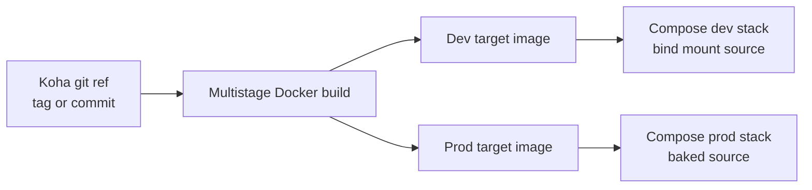

# Koha Alpine Fixed-Version Production Image Strategy

## 1) Objective

Define a dual-track container strategy for this project:

- Development/Test track: keep the current source-mounted, git-driven workflow for active development and migration testing.
- Production track: build immutable Alpine images with a fixed Koha version baked in, optimized for runtime efficiency and operational stability.

Target outcome:

- predictable production behavior per Koha version,
- a clear upgrade path between versions,
- no runtime dependence on host source mounts for production containers.

## 2) Why this split is needed

Current Alpine workflow is excellent for development because it:

- mounts host source into the container,
- supports rapid code iteration,
- supports misc4dev/bootstrap helpers for re-seeding and experiments.

For production, those same traits increase drift and startup work:

- mutable source content at runtime,
- repeated bootstrap/config convergence steps,
- larger operational surface than needed for serving a fixed release.

A production image should start fast, run lean, and be immutable except for data volumes.

## 3) Proposed architecture (two image targets)

Single repository, single Dockerfile, two explicit targets.

1. Target A: dev image
- Keeps current behavior: bind mount source, development tools, test helpers.
- Intended for migration work, patch testing, and Koha branch/tag exploration.

2. Target B: prod image
- Bakes a pinned Koha release into image layers.
- Removes development-only runtime dependencies.
- Uses production-safe defaults and reduced startup mutation.

## 4) Multistage Dockerfile design

Transform Dockerfile-Alpine into multistage with named targets.

Suggested stages:

1. base-runtime
- Alpine OS + core runtime packages + required Perl modules.
- Common foundation for both dev and prod targets.

2. koha-fetch
- Clone Koha using build args (version tag/commit/branch).
- Resolve exact ref and record metadata labels.

3. koha-build-assets
- Run yarn/npm asset build once during image build.
- Produce static assets as immutable artifacts.

4. dev-tools
- Add misc4dev, gitify (if still needed during transition), qa-test-tools, debug conveniences.
- Keep run.sh dev behavior and source mount compatibility.

5. prod-runtime
- Copy only required runtime artifacts from prior stages.
- Exclude development helpers and unnecessary build tools.
- Keep only what is required to start and run the fixed Koha instance.

## 5) Fixed version pinning model

Production image must be tied to an immutable source identifier.

Recommended build args:

- KOHA_VERSION (human-readable release marker, for example 26.11.00)
- KOHA_GIT_REF (tag or commit SHA)
- KOHA_GIT_URL (optional override, default upstream)

Recommended OCI labels:

- org.opencontainers.image.version
- org.opencontainers.image.revision
- org.opencontainers.image.source
- org.opencontainers.image.created

Policy:

- production builds must use tag or commit SHA, never floating branch names,
- image tags must include Koha version.

## 6) Container and image naming by Koha version

You requested containers named after the Koha version they run.

Recommended naming convention:

1. Image tags
- kosson/koha-alpine-prod:26.11.00
- kosson/koha-alpine-dev:26.11

2. Compose project name for production deployment
- koha-prod-26-11-00

3. Service/container names (if explicitly set)
- koha-26-11-00
- db-26-11-00
- rabbitmq-26-11-00

Implementation note:

- In Docker Compose, prefer project-name level versioning first, because explicit container_name reduces scaling flexibility.
- If strict explicit names are required, set them via environment variables in a production compose override.

## 7) Compose split: dev versus prod

Create two compose entrypoints or overlays.

1. Development compose
- Keep source bind mount to /kohadevbox/koha.
- Keep current bootstrap profile and helper scripts.

2. Production compose
- Remove source bind mount.
- Use baked image only.
- Enable restart policies and health checks.
- Keep persistent volumes only for data, logs, and optional plugin/runtime state.

Recommended files:

- docker-compose-alpinekoha.yml (dev-oriented base)
- docker-compose.prod.yml (production override)

## 8) Production runtime efficiency targets

Production target should be optimized for fast, stable startup:

1. Eliminate unnecessary startup work
- skip development-only scripts and helpers,
- avoid repeated gitify/misc4dev conversion loops,
- avoid yarn install at runtime.

2. Minimize runtime package set
- remove compilers and build toolchain from final prod target,
- keep only runtime dependencies.

3. Keep data external
- database, cache, broker, search remain external services,
- container is stateless except explicit mounted runtime state.

4. Pre-warm static assets at build time
- compile frontend assets in build stage and copy into final image.

5. Health and readiness
- add healthcheck endpoints and dependency checks aligned with service start order.

## 9) Security and operational hardening for production target

1. Principle of least privilege
- drop unnecessary Linux capabilities,
- run non-root where feasible after bootstrap needs are addressed.

2. Filesystem hardening
- read-only root filesystem where practical,
- writable mounts only where required.

3. Supply chain and reproducibility
- pin base image digests and Koha source refs,
- generate SBOM/provenance artifacts if your pipeline supports it.

4. Secrets handling
- do not bake secrets into image,
- inject via environment/secret store at deploy time.

## 10) Migration roadmap from current state

Phase 1: Introduce multistage without behavior change
- Keep current target as default.
- Add explicit dev and prod targets.

Phase 2: Create production compose profile
- Remove bind mounts.
- Add versioned naming and tags.

Phase 3: Reduce prod bootstrap logic
- disable development-only setup paths.
- keep only essential instance/bootstrap steps.

Phase 4: Validate and benchmark
- startup time, memory, container size, and restart behavior.

Phase 5: Promote production track
- document release process for each Koha version.

## 11) Acceptance criteria

A production version build is considered complete when:

1. Image is built from a pinned Koha tag/commit and tagged with the same version.
2. Container runs without source bind mount.
3. Container/project naming clearly includes Koha version.
4. First start and restart are deterministic.
5. Runtime does not execute development-only helper workflows.
6. Health checks pass and service endpoints are reachable.
7. Rollback to prior image tag is straightforward.

## 12) Suggested implementation details for this repository

1. Dockerfile
- Keep Dockerfile-Alpine as source of truth, refactor into named targets:
  - target dev
  - target prod

2. Environment variables
- Add production-oriented vars:
  - KOHA_RELEASE_VERSION
  - KOHA_RELEASE_REF
  - KOHA_CONTAINER_SUFFIX

3. stack-alpine.sh extensions
- Add build mode flag:
  - --image-mode dev|prod
- Add version flag:
  - --koha-version 26.11.00
- Derive image tag and compose project name from these values.

4. Production command examples

Build prod image for a fixed version:

docker build \
  --target prod-runtime \
  --build-arg KOHA_VERSION=26.11.00 \
  --build-arg KOHA_GIT_REF=v26.11.00 \
  -t kosson/koha-alpine-prod:26.11.00 \
  -f Dockerfile-Alpine .

Run production profile with versioned project name:

COMPOSE_PROJECT_NAME=koha-prod-26-11-00 \
KOHA_ALPINE_IMAGE_TAG=kosson/koha-alpine-prod:26.11.00 \
docker compose -f docker-compose-alpinekoha.yml -f docker-compose.prod.yml up -d

## 13) Open decisions

Before implementation, decide explicitly:

1. Whether Apache/plack remain in same container for production v1.
2. How much of current run.sh bootstrap remains in prod target.
3. Whether gitify dependency is fully removed before first prod release.
4. Whether database initialization is done in-app container or in a one-shot job.

## 14) Recommended first iteration (practical)

For fastest success with low risk:

1. Keep current dev stack unchanged.
2. Add prod target in multistage Dockerfile with baked Koha source and prebuilt assets.
3. Add production compose override removing source mount and enforcing versioned image tag.
4. Keep operational model similar to today, then reduce bootstrap complexity in follow-up iterations.

This gives immediate separation between dev and prod behavior while preserving the migration momentum of the current Alpine work.
