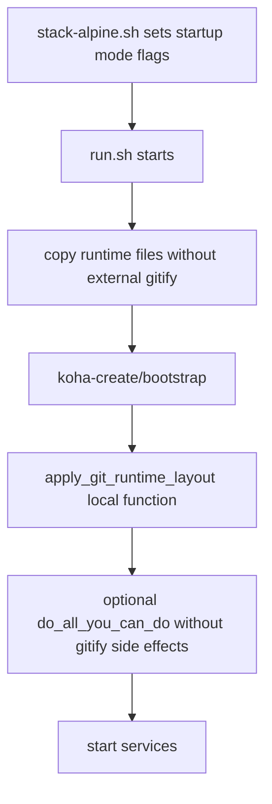

# koha-gitify in Alpine migration: function, runtime stages, and elimination plan

koha-gitify reconfigures a standard Koha library system installation so that it runs live code from a Git checkout instead of the pre-packaged system files.

It is used by Koha developers who installed Koha using standard Linux packages (koha-common), but want a specific library instance to run off a local Git repository (e.g., for developing custom features or testing patches).

## 1) Scope and objective

This report documents:

- what `koha-gitify` does in the Alpine stack,
- exactly where project scripts depend on it,
- at which startup stages it runs,
- how to reduce and then remove this dependency by absorbing behavior into project-owned scripts.

Target outcome: define a practical path to eliminate runtime dependence on the external `koha-gitify` repository.

## 2) Evidence base (current code)

Primary references used in this report:

- `koha-alpine/Dockerfile-Alpine` (helper repo clone stage)
- `koha-alpine/files-alpine/run.sh` (entrypoint orchestration)
- `koha-alpine/files-alpine/lib/run-sh-alpine.sh` (runtime helper functions)
- `koha-alpine/files-alpine/misc4dev/cp_alpine_files.pl` (Alpine runtime file copy + gitify call)
- `koha-misc4dev/do_all_you_can_do.pl` (indirect path back to gitify via `cp_debian_files.pl`)
- `koha-alpine/files-alpine/templates/bash_aliases` (manual operator path)
- `koha-alpine/stack-alpine.sh` (host-side control of startup profiles that decide whether indirect gitify paths execute)
- `koha-alpine/tests/artifacts/integration-20260724T071026Z/test_alpine_startup_smoke.log` (runtime log proof of gitify execution)
- `gitify/README.md` (upstream tool purpose, expected workflow, and operator usage)
- `gitify/koha-gitify` (inline comments and POD documentation that define behavior and limits)

## 2.1) Upstream intent and assumptions from gitify repo

Useful facts from the local cloned `gitify` repository:

1. Stated purpose in README
- `koha-gitify` is explicitly described as converting an existing Koha package install to use source code from a git repository.

2. Expected preconditions
- an instance already created by `koha-create`,
- a valid instance directory under `/etc/koha/sites/<instance>`,
- a git checkout path passed as an absolute path.

3. Operator workflow expected by upstream docs
- run `sudo ./koha-gitify <instance> <absolute-path-to-koha-clone>`,
- restart Apache after conversion.

4. Script comments define conversion scope
- build shared `*-git.conf` Apache include files from non-git templates,
- leave some Apache site-level concerns to per-instance `sites-available/<instance>[.conf]`,
- modify `koha-conf.xml`, Apache instance vhost config, and plack config.

5. Script comments/documentation also expose limitations
- TODO mentions zebradb definition links are not handled by the script,
- behavior is conversion-focused, not full environment bootstrap.

## 3) Functional role of koha-gitify

`koha-gitify` is a configuration rewrite tool, not a filesystem mount/link tool.

The host-to-container mapping for Koha source is a Docker bind mount, defined in compose: `docker-compose-alpinekoha.yml`:49

The path source for that mount is SYNC_REPO from env:`.env`:8

koha-gitify is called as a script by your runtime helpers:

- `cp_alpine_files.pl`:76
- `run.sh`:410
- `do_all_you_can_do.pl`:129

Very clear definition of "points instance to `/kohadevbox/koha`":

- it edits Koha and Apache configuration files so runtime paths reference the git checkout directory,
- it swaps package paths such as `/usr/share/koha/...` with git paths under `/kohadevbox/koha/...`,
- it changes Apache include targets from non-git conf to `*-git.conf`,
- it writes ScriptAlias/DocumentRoot/PERL5LIB values that resolve scripts and modules from the git checkout.

What it does, with direct evidence from the upstream script:

1. Creates (or reuses) git-mode Apache shared configs:
- `/etc/koha/apache-shared-opac-git.conf`
- `/etc/koha/apache-shared-intranet-git.conf`

2. Rewrites instance Koha config:
- file: `/etc/koha/sites/<instance>/koha-conf.xml`
- replaces default package locations (`/usr/share/koha/...`) with git checkout locations (`<gitcheckout>/...`).

3. Rewrites Apache virtual host config:
- file: `/etc/apache2/sites-available/<instance>[.conf]`
- changes `Include /etc/koha/apache-shared-*.conf` to `Include /etc/koha/apache-shared-*-git.conf`
- injects `SetEnv PERL5LIB`, `DocumentRoot`, and `ScriptAlias` entries pointing to the git checkout.

4. Rewrites plack entrypoint paths:
- source: `/etc/koha/plack.psgi` or `/etc/koha/sites/<instance>/plack.psgi`
- output: `/etc/koha/sites/<instance>/plack.psgi` with git checkout paths.

5. Creates backup copies before edits:
- it writes `.bkp` files for modified configs.

6. Enforces strict invocation contract:
- requires exactly two arguments: instance name and absolute git checkout path,
- fails if checkout directory or `/etc/koha/sites/<instance>` does not exist.

7. Reuse behavior that impacts repeatability:
- if `/etc/koha/apache-shared-opac-git.conf` or `/etc/koha/apache-shared-intranet-git.conf` already exist, script reuses them instead of rebuilding from templates.

8. Post-step expected by upstream script output:
- conversion prints a reminder to restart Apache for changes to take effect.

Important non-behavior (answer to your symlink question):

- `koha-gitify` does not create the bind mount.
- `koha-gitify` does not create a symlink to `/kohadevbox/koha`.
- `koha-gitify` does not run `ln -s` for Koha code path switching.

Where `/kohadevbox/koha` actually comes from:

- it is provided by Docker Compose bind mount configuration:
  - `${SYNC_REPO}:/kohadevbox/koha`
- therefore mount creation is a container start responsibility (compose/docker), not a `koha-gitify` responsibility.

Observed runtime proof still matches this behavior:

- startup log line: `gitifying kohadev (/etc/koha/sites/kohadev) to point at '/kohadevbox/koha'`

Interpretation of that log line:

- "point at" means "rewrite config to reference this path", not "create mount/link at this path".

## 4) Dependency map in this project

## 4.1 Build-time dependency

`koha-alpine/Dockerfile-Alpine` clones `koha-gitify` into `/kohadevbox/gitify`.

Why this matters:

- startup scripts expect `/kohadevbox/gitify/koha-gitify` to exist,
- the dependency is currently image-baked and external-repo based.

## 4.2 Runtime dependency edges

There are three runtime invocation paths:

1. Early runtime path (indirect)
- `run.sh` calls `copy_runtime_files`.
- `copy_runtime_files` calls `cp_alpine_files.pl --gitify_dir ${BUILD_DIR}/gitify`.
- `cp_alpine_files.pl` executes: `cd $gitify_dir; sudo ./koha-gitify $instance $koha_dir`.

2. Mid runtime path (direct)
- `run.sh` explicitly runs:
  - `cd ${BUILD_DIR}/gitify`
  - `./koha-gitify ${KOHA_INSTANCE} "/kohadevbox/koha"`

3. Late runtime path (indirect through full population)
- `run.sh` may execute `do_all_you_can_do.pl --gitify_dir ${BUILD_DIR}/gitify`.
- `do_all_you_can_do.pl` always calls `cp_debian_files.pl --gitify_dir=...`.
- `cp_debian_files.pl` runs `koha-gitify` again.

Manual operator path:

- `bash_aliases` exposes `cp_debian_files` alias with `--gitify_dir=/kohadevbox/gitify`, enabling ad-hoc re-gitification.

## 5) Stage-by-stage execution in startup lifecycle

## Stage A: image build

- script: `Dockerfile-Alpine`
- action: clones `koha-gitify` repo
- stage type: build-time prerequisite

## Stage B: entrypoint early filesystem prep

- script chain:
  - `run.sh` -> `copy_runtime_files`
  - `run-sh-alpine.sh` -> `cp_alpine_files.pl`
  - `cp_alpine_files.pl` -> `koha-gitify`
- stage type: early runtime preparation before DB bootstrap logic

## Stage C: post-bootstrap explicit convergence

- script: `run.sh`
- action: direct `./koha-gitify ...`
- stage type: runtime convergence after `koha-create`, user setup, and git setup

## Stage D: optional full population path

- script chain:
  - `run.sh` -> `do_all_you_can_do.pl`
  - `do_all_you_can_do.pl` -> `cp_debian_files.pl`
  - `cp_debian_files.pl` -> `koha-gitify`
- stage type: runtime full-install/fill path

Whether Stage D runs is controlled by startup policy set by `stack-alpine.sh` and runtime detection in `run.sh`:

- fresh DB path: Stage D runs,
- existing DB + resume profile: Stage D skipped,
- existing DB + full profile: Stage D runs.

## 6) Invocation count by startup mode

Approximate `koha-gitify` runs per container startup:

- Fresh DB (`start` default): 3 times
  - Stage B + Stage C + Stage D

- Existing DB with resume profile (`start --no-fresh-db`, default resume): 2 times
  - Stage B + Stage C

- Existing DB with full profile (`--bootstrap-profile full`): 3 times
  - Stage B + Stage C + Stage D

- Manual maintenance from shell alias:
  - +1 per manual `cp_debian_files` run

This confirms duplication: one direct path plus one or two indirect paths in the same startup.

## 7) Risk analysis of current dependency

1. External source dependency
- image build relies on cloning external `koha-gitify`.

2. Repeated mutable rewrites
- same configuration conversion can run multiple times in one startup.

3. Hidden coupling through misc4dev
- even if direct `run.sh` call is removed, `do_all_you_can_do.pl` still reintroduces `koha-gitify` through `cp_debian_files.pl`.

4. Operational unpredictability
- behavior depends on startup profile and DB state, so gitify side effects are not uniform across runs.

5. Partial regeneration behavior
- existing `*-git.conf` files are reused, so repeated runs may not fully converge if source non-git templates changed.

6. Scope gap acknowledged upstream
- script TODO indicates zebradb definition link handling is out of scope; other scripts must fill that gap.

## 8) Recommendations to reduce and then eliminate dependency

## 8.1 Immediate reduction (low risk, no behavior redesign)

1. Introduce a single-owner stage in `run.sh`
- Add `GITIFY_MODE` env toggle with values such as `auto|pre|post|off`.
- Keep only one direct execution point (recommended: post-bootstrap in current flow).

2. Gate indirect invocations
- Add `--skip-gitify` support to `cp_alpine_files.pl` and (if maintained locally) `cp_debian_files.pl` wrapper behavior.
- When `run.sh` owns gitify, pass skip flags so helper scripts do not invoke it.

3. Add idempotence marker
- Write a small marker file after successful conversion (for example under `/var/run/koha/${KOHA_INSTANCE}/`).
- Skip repeated conversion in same boot unless `FORCE_GITIFY=yes`.

## 8.2 Absorb behavior into run.sh (medium risk, controlled migration)

Goal: replace external `koha-gitify` execution with project-owned logic.

Implementation approach:

1. Create a local function in `files-alpine/lib/run-sh-alpine.sh` (or a new sourced file), for example `apply_git_runtime_layout`.

2. Function responsibilities should cover only what this stack needs:
- generate/refresh git-mode Apache include files under `/etc/koha/`,
- update instance config paths in `/etc/koha/sites/${KOHA_INSTANCE}/koha-conf.xml`,
- re-own touched files for `${KOHA_INSTANCE}-koha`.

3. Switch `run.sh` to call local function, behind feature flag first:
- `USE_LOCAL_GITIFY=yes|no` (default `no` during transition),
- compare outputs and startup behavior in both modes.

4. Once equivalent behavior is validated, remove direct external call in `run.sh`.

## 8.3 Absorb orchestration into stack-alpine.sh (complementary, not full replacement)

Important: `stack-alpine.sh` cannot replace in-container file rewrites directly because those target container paths and instance state.

What it can do:

1. Control invocation policy centrally
- export mode flags (`GITIFY_MODE`, `USE_LOCAL_GITIFY`, `FORCE_GITIFY`) into container environment.

2. Prevent unnecessary Stage D rewrites
- default existing-DB starts to resume profile unless operator explicitly requests full.

3. Expose explicit maintenance command
- add a host command that executes a single in-container conversion when needed (diagnostics or recovery), not on every start.

## 8.4 Full elimination roadmap (recommended)

Phase 1: De-duplicate
- keep one gitify owner path in `run.sh`.

Phase 2: Localize logic
- implement local conversion function and run in parallel test mode.

Phase 3: Decouple misc4dev path
- ensure `cp_alpine_files.pl` and full-bootstrap path can skip external gitify call.

Phase 4: Remove external repo
- delete `git clone ... koha-gitify` from `Dockerfile-Alpine`,
- remove `${BUILD_DIR}/gitify` assumptions from scripts and aliases,
- keep a compatibility shim only if needed for transition.

Phase 5: Hardening
- add a startup smoke check that verifies resulting runtime paths point to `/kohadevbox/koha` and Apache includes are present.

## 9) Proposed final-state architecture

Result:

- no external `koha-gitify` clone required,
- one deterministic conversion stage,
- explicit and testable ownership in project code.

## 10) Concrete next actions

1. Add `GITIFY_MODE` and `USE_LOCAL_GITIFY` env plumbing to `stack-alpine.sh` and `run.sh`.
2. Implement `--skip-gitify` in `cp_alpine_files.pl` and use it from `copy_runtime_files` when direct/local mode is selected.
3. Add local `apply_git_runtime_layout` function in `files-alpine/lib/` and run A/B validation against current external behavior.
4. Remove duplicate path (Stage B or Stage C), keep one owner only.
5. After parity validation, remove gitify clone from `Dockerfile-Alpine` and clean up aliases/env references.

## 11) Appendix: koha-gitify edit map (patterns and effects)

This appendix summarizes exactly what `koha-gitify` edits, what pattern it matches, and what runtime behavior changes.

| Target file(s) | Replacement / generation pattern | Runtime effect |
|---|---|---|
| `/etc/koha/apache-shared-opac-git.conf` (generated or reused) | Built from `/etc/koha/apache-shared-opac.conf`; comments out `DocumentRoot` and `ScriptAlias`; appends `<Directory "<gitcheckout>"> Require all granted </Directory>` | Allows Apache include for OPAC git-mode pathing while keeping final route wiring in instance vhost file |
| `/etc/koha/apache-shared-intranet-git.conf` (generated or reused) | Built from `/etc/koha/apache-shared-intranet.conf`; same comment-out pattern and appended `<Directory>` grant | Same as above for intranet include path |
| `/etc/koha/sites/<instance>/koha-conf.xml` | Replaces package paths with git checkout paths: `/usr/share/koha/intranet/cgi-bin` -> `<gitcheckout>`; `/usr/share/koha/intranet/htdocs/intranet-tmpl` -> `<gitcheckout>/koha-tmpl/intranet-tmpl`; `/usr/share/koha/opac/cgi-bin/opac` -> `<gitcheckout>/opac`; `/usr/share/koha/opac/htdocs/opac-tmpl` -> `<gitcheckout>/koha-tmpl/opac-tmpl`; `/usr/share/doc/koha-common` -> `<gitcheckout>/docs` | Koha runtime components resolve code/templates/docs from git checkout instead of package filesystem |
| `/etc/apache2/sites-available/<instance>` or `/etc/apache2/sites-available/<instance>.conf` | Replaces `Include /etc/koha/apache-shared-opac.conf` with `Include /etc/koha/apache-shared-opac-git.conf` plus OPAC git directives (`SetEnv PERL5LIB`, `DocumentRoot`, `ScriptAlias` to checkout); replaces `Include /etc/koha/apache-shared-intranet.conf` similarly with intranet git directives | Apache vhost routing, CGI entrypoints, and Perl module path all point to git checkout |
| `/etc/koha/plack.psgi` or `/etc/koha/sites/<instance>/plack.psgi` -> output `/etc/koha/sites/<instance>/plack.psgi` | Replaces plack path tokens: `/usr/share/koha/lib` -> `<gitcheckout>`; `/usr/share/koha/intranet/cgi-bin` -> `<gitcheckout>`; `/usr/share/koha/api` -> `<gitcheckout>/api`; `/usr/share/koha/opac/cgi-bin/opac` -> `<gitcheckout>/opac` | plack app loads code paths from git checkout |
| `*.bkp` backups for edited files | Before writes, script copies original files to `*.bkp` companions | Provides rollback artifact and evidence of one-step conversion |

Additional operational notes from script behavior:

- Existing `apache-shared-*-git.conf` files are reused if present, not regenerated by default.
- Script requires exactly two args: instance name and absolute checkout path.
- Script fails if instance directory or checkout directory is missing.
- Script prints a reminder to restart Apache after conversion.

