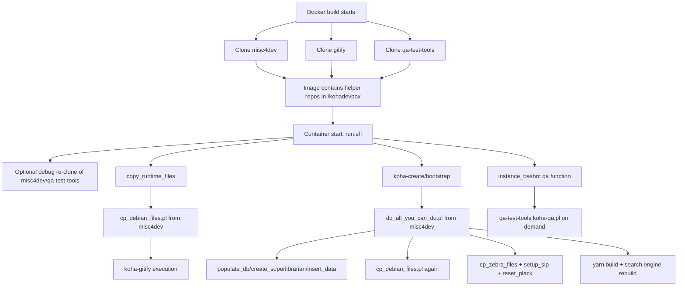
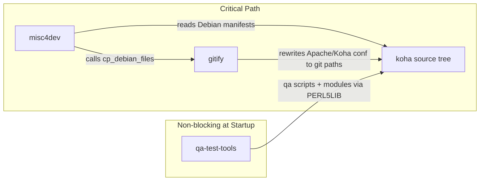

# Koha Alpine Helper Repositories: Runtime Roles and Build-Time Integration Plan

## 1) Scope and goal

This report analyzes the three repositories cloned in the Alpine image build:

- `koha-misc4dev`
- `koha-gitify`
- `qa-test-tools`

Goal: identify what each repository does in the active build-up and runtime of the Koha container, then determine what can be integrated safely into `Dockerfile-Alpine` at image build time versus what must stay in container startup.

Primary execution path reviewed:

- Image build clone step in `Dockerfile-Alpine`
- Alpine entrypoint orchestration in `files-alpine/run.sh`
- Alpine helper functions in `files-alpine/lib/run-sh-alpine.sh`
- Shell/runtime exposure via `files-alpine/templates/*.bash*`

## 2) Where the repos are consumed

## 2.1 Build-time (image creation)

`Dockerfile-Alpine` clones all three repositories into `/kohadevbox`:

- `misc4dev`
- `gitify`
- `qa-test-tools`

This guarantees tools are present even when debug override flags are not used.

## 2.2 Runtime (container startup)

`files-alpine/run.sh` optionally re-clones `misc4dev` and `qa-test-tools` when debug flags are enabled:

- `DEBUG_GIT_REPO_MISC4DEV=yes`
- `DEBUG_GIT_REPO_QATESTTOOLS=yes`

Then runtime uses:

- `copy_runtime_files` from `run-sh-alpine.sh` (prefers `/kohadevbox/misc4dev/cp_alpine_files.pl` at runtime, falls back to `/kohadevbox/misc4dev/cp_debian_files.pl` from `misc4dev`)
- direct `./koha-gitify` execution from `/kohadevbox/gitify`
- `perl /kohadevbox/misc4dev/do_all_you_can_do.pl ...` for DB bootstrap and full setup path

`qa-test-tools` is not called automatically by the boot pipeline, but it is exposed for user workflows via `PERL5LIB` and the `qa()` helper function in `instance_bashrc`.

## 3) Detailed role per repository

## 3.1 `koha-misc4dev`: bootstrap orchestrator and data/setup engine

This is the most critical repository for container bring-up.

### Main entrypoints used

- `cp_debian_files.pl`
- `do_all_you_can_do.pl`

### What `cp_debian_files.pl` does

- Reads Koha Debian install manifest (`debian/koha-common.install`) from the mounted Koha source.
- Copies files into Debian-like target locations in the container filesystem.
- Copies Debian service/support files from `koha/debian/` into `/etc` locations.
- Generates Koha manpages via `xsltproc` + docbook stylesheets.
- Refreshes Apache git-mode includes by calling `koha-gitify` from the `gitify` repo.
- Re-owns `/etc/koha/sites/<instance>` to the Koha instance user.

This explains why Alpine had to add Debian-like directory and command compatibility shims.

### What `do_all_you_can_do.pl` does

This is a fan-out script for full environment setup:

- DB emptiness guard (`Database is not empty!` unless `--use-existing-db`)
- On fresh DB:
  - `populate_db.pl`
  - `create_superlibrarian.pl`
  - `insert_data.pl` (demo bibliographic/authority/item/patron data)
- Calls `cp_debian_files.pl` again
- Calls `cp_zebra_files.pl`
- Calls `setup_sip.pl`
- Calls `reset_plack.pl`
- Optionally installs plugins
- Restarts Apache
- Builds frontend assets with yarn (version-gated logic)
- Rebuilds Elasticsearch (if selected)
- Rebuilds Zebra unconditionally at the end

In Alpine `run.sh`, this script is sometimes patched at runtime in Elasticsearch mode to avoid startup failure from Zebra rebuild edge cases.

### Alpine-specific implication

`misc4dev` carries runtime assumptions from Debian package flows. In Alpine, these assumptions are currently satisfied by:

- compatibility shims in `Dockerfile-Alpine`
- runtime fallbacks/patching in `run.sh`

## 3.2 `koha-gitify`: instance re-pointing from package layout to git checkout layout

`koha-gitify` rewrites instance configuration so runtime serves code from `/kohadevbox/koha` (git source) instead of package paths.

### Functional behavior of `koha-gitify`

- Creates or refreshes:
  - `/etc/koha/apache-shared-opac-git.conf`
  - `/etc/koha/apache-shared-intranet-git.conf`
- Rewrites paths inside:
  - `/etc/koha/sites/<instance>/koha-conf.xml`
  - `/etc/apache2/sites-available/<instance>[.conf]`
  - plack psgi file(s)
- Injects `PERL5LIB` and Apache script aliases for git checkout execution.

### Where it is invoked

- Indirectly from `misc4dev/cp_debian_files.pl`
- Directly from `files-alpine/run.sh` (`cd /kohadevbox/gitify && ./koha-gitify ...`)

This means gitification may run multiple times during startup, but that also helps idempotent convergence of config files.

## 3.3 `qa-test-tools`: developer QA toolkit, not startup-critical

`qa-test-tools` provides:

- `koha-qa.pl` orchestration
- `QohA::*` modules for file checks, git diff checks, perlcritic, XML/YAML checks, etc.
- hook/test utilities

### In active Alpine flow

- Not required for base startup path.
- Included in `PERL5LIB` in environment templates.
- Exposed through `qa()` function in `instance_bashrc`, which checks out the suitable branch/tag in `qa-test-tools` and runs `koha-qa.pl`.

Operationally: this repo supports developer and CI quality workflows, not initial DB/bootstrap for production-like runtime.

## 4) Lifecycle map (who does what, when)

## 5) Dependency and criticality view

## 6) What can move to Docker build-time vs what must remain runtime

## 6.1 Safe build-time integration candidates

These are deterministic filesystem preparation tasks and do not require a live DB/service state:

- Clone and pin helper repos (already done).
- Preinstall dependencies needed by `misc4dev` script family.
- Precreate Debian-expected target directories and command shims (already done in large part).
- Normalize line endings and executable bits for helper scripts.
- Optionally run static prechecks (syntax checks) against helper scripts.

## 6.2 Runtime-only tasks (cannot be fully moved to build)

These require runtime values, mounted Koha source, or live services:

- DB existence detection and decisions (`USE_EXISTING_DB`, `ALPINE_BOOTSTRAP_PROFILE`).
- `populate_db.pl`, `create_superlibrarian.pl`, `insert_data.pl`.
- Instance-specific `koha-gitify` and conf rewrites tied to runtime instance name and mounted path.
- Search index rebuilds (OpenSearch/Zebra).
- SIP/plack reset tied to created instance and generated config files.

## 6.3 Current duplication/inefficiency worth addressing

- `koha-gitify` is executed both directly in `run.sh` and indirectly via `cp_debian_files.pl` (and again inside `do_all_you_can_do.pl` through `cp_debian_files.pl`).
- `cp_debian_files.pl` can run before and during `do_all_you_can_do.pl`.

This is often safe (idempotent-ish) but increases startup time and complexity.

## 7) Practical integration strategy for `Dockerfile-Alpine`

## Phase A: Stabilize and pin helper repos

- Add build args for commit pins:
  - `MISC4DEV_REF`
  - `GITIFY_REF`
  - `QATESTTOOLS_REF`
- Clone then checkout explicit refs to improve reproducibility.

## Phase B: Reduce runtime bootstrap volatility

- Keep debug re-clone flags, but default to pinned image-baked copies.
- Add a startup check that logs the exact helper repo SHAs in use.

## Phase C: Move precomputable prep to build

- Keep all distro-compatibility shims in Dockerfile (already the correct direction).
- Add optional build-time validation block (non-fatal warnings) for:
  - helper script presence (`do_all_you_can_do.pl`, `cp_debian_files.pl`, `koha-gitify`, `koha-qa.pl`)
  - Perl syntax checks for helper scripts.

## Phase D: Keep mutable operations runtime

- Preserve `do_all_you_can_do.pl` runtime execution for DB and instance initialization.
- Preserve runtime `koha-gitify` so mounted source path and instance naming stay accurate.

## 8) Repository-by-repository conclusion

- `koha-misc4dev`: core bootstrap engine. Mandatory for current startup design. Strong DB and system setup implications.
- `koha-gitify`: core config conversion layer that points Koha runtime to git source. Mandatory in current git-driven workflow.
- `qa-test-tools`: optional at startup, essential for developer QA workflows. Keep in image for convenience and consistent tooling, but it is not a hard dependency for service bring-up.

## 9) Recommended next implementation steps

1. Introduce helper repo ref pinning in `Dockerfile-Alpine` (build args + checkout).
2. Emit helper repo SHAs at container start in `run.sh` for traceability.
3. Decide whether to eliminate one `koha-gitify` invocation path to reduce duplication.
4. Keep `qa-test-tools` in image, but treat failures to refresh it (debug mode) as non-fatal.
5. If desired, split `do_all_you_can_do.pl` behavior into explicit runtime modes (`fresh`, `reuse`, `minimal`) to avoid patch-at-runtime patterns.
